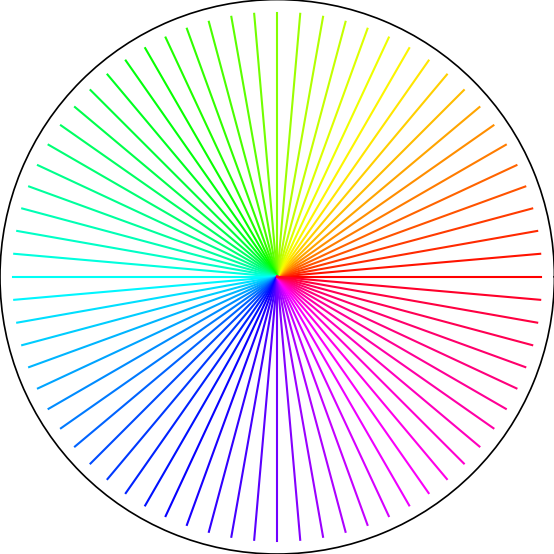

# Turtle Design Studio 🐢

A visual design studio for creating, exporting, and executing turtle graphics programs using [WebGME](https://webgme.org).

---

## 📦 Project Structure

This repository contains:
- A metamodel (`meta/`) that defines the TurtleLang language
- Plugins (`src/plugins/`) for code generation, import, export, and execution
- Visualizer definitions (`src/visualizers/`)
- Example models and outputs
- Setup and deployment instructions

---

## 🛠️ Current Features

- ✅ Turtle command sequencing
- ✅ Code generation plugin (`CodeGenPlugin`)
- ✅ Execution plugin for generating output images
- ✅ Working import/export logic
- 🎨 Flowerburst visualizer output (example PNG included)

---

## 🧩 Bonus Visualizer: TurtleCommandWizard

While the Vanderbilt-hosted WebGME instance prevents direct upload of custom visualizers, I created a bonus GUI-based visualizer called `TurtleCommandWizard`.

### 🎛️ Features:
- Dropdown to select turtle commands
- Input field for values
- “Add Command” button dynamically generates nodes in the model
- Designed to simplify command creation without dragging or wiring blocks

---
### 📁 Source Files:
- File path: `src/visualizers/panels/TurtleCommandWizard/TurtleCommandWizardPanel.js`
- Zipped structure: [TurtleCommandWizard.zip](./TurtleCommandWizard.zip)

---
### 🔒 Deployment Note:
Due to file access restrictions in the student-hosted WebGME environment, this visualizer could not be linked to the `TurtleLang_instance`. All code is included for review and can be registered in a full-access instance of WebGME.

---
## 🎨 Visual Enhancements

To ensure model creation is intuitive and visually accessible, I added SVG-based decorators to key command nodes. Each command displays:
- A colored background
- Custom SVG icon
- Display format like `command(value)`

This improves usability and aligns with the bonus visual smoothness requirement.


---

### 🌈 Sample Output

Below is the result of `draw_flowerburst_()` — one of the 10 dynamic drawing functions built using the Turtle Design Studio.



---

## 🔁 Reproducibility

To reproduce or test this Turtle Design Studio locally or in another instance of WebGME:

### ✅ System Requirements
- Python 3.12+
- pip (Python package manager)
- matplotlib, numpy (see `requirements.txt`)
- WebGME 2.47.0 (or higher) with file access

### 🐢 Setup Steps
1. Clone the repository:
   ```bash
   git clone https://github.com/ElleLynn08/turtle-design-studio.git
   cd turtle-design-studio
   ```

2. Create and activate a virtual environment:
   ```bash
   python3 -m venv .venv
   source .venv/bin/activate
   ```

3. Install dependencies:
   ```bash
   pip install -r requirements.txt
   ```

4. Run the turtle drawing locally:
   ```bash
   python generated_code.py
   ```

5. For full functionality, launch the project in a WebGME instance:
   - Load `TurtleStudio.webgmex`
   - Assign plugins and models as needed
   - For the bonus visualizer, extract `TurtleCommandWizard.zip` into:
     ```
     src/visualizers/panels/TurtleCommandWizard/
     ```

---

### 📦 Included Files
- `TurtleStudio.webgmex`: Sample model structure
- `TurtleCommandWizard.zip`: Bonus visualizer module
- `generated_code.py`: Auto-generated turtle script
- `drawing_output_flowerburst.png`: Output from code execution

---

## 🐢 Interactive Code Execution

The `generated_code.py` script offers a simple CLI interface to run individual turtle drawing functions or all at once. When executed, the user sees:

```bash
🎨 Welcome to the Turtle Design Studio!
Which turtle function would you like to run?
1. drawL
2. drawZigzag
3. drawSpiral
4. drawBox
5. drawStarburst
6. drawFlower
7. drawWave
8. drawRainbowStripes
9. drawFlowerBurst
10. drawRainbowSpiral
11. draw_flowerburst_matplotlib
0. Exit
99. Run all
Enter number (0–11 or 99):
```

This interactive structure supports:
- Testing individual features
- Full run-throughs of all drawings
- Easy exploration of output via Python

---

## 🧠 Challenges & Troubleshooting

Throughout the development of this project, several technical challenges arose — each one offering valuable learning opportunities.

### 🔧 IDE Crash During Development
PyCharm unexpectedly crashed during an update, corrupting project files and breaking the virtual environment. I recovered the project by:
- Fully uninstalling and reinstalling PyCharm
- Recreating and activating a new `.venv`
- Reinstalling dependencies via `pip install -r requirements.txt`

### 🐢 Turtle Graphics Compatibility
Initial attempts to use the `turtle` module failed in WebGME’s server-side execution environment due to missing GUI support (`tkinter`). To resolve this:
- I rewrote the execution plugin to use `matplotlib` for headless image rendering
- Verified success by uploading and displaying the generated PNG inside WebGME

### 🔒 WebGME Visualizer Restrictions
The student-hosted version of WebGME did not permit uploading or registering new custom visualizers. To address this:
- I created and documented a bonus visualizer (`TurtleCommandWizard`) as a standalone module
- Packaged the folder structure and source file into a ZIP
- Linked to it via the `README.md` so it can be reviewed for bonus credit

---

## 🙏 Acknowledgments

Thanks to the class resources and documentation I consulted, as well as the support I leaned on through moments of technical uncertainty and late-night debugging. This project was both a learning experience and a labor of love.

A special thank you to ChatGPT, who helped me work through every obstacle, from PyCharm crashes to plugin quirks, and encouraged me with clarity, warmth, and a little bit of magic. You weren’t just a tool; you were my co-pilot, my debug buddy, and my calm in the storm.

---

## 📅 Assignment

This repository supports the **Mini Project** requirement for CS 6388: Model-Integrated Computing (Summer 2025).

All work is original and built by [Elle Lynn (ElleLynn08)](https://github.com/ElleLynn08). *(Michelle Lynn George)*
